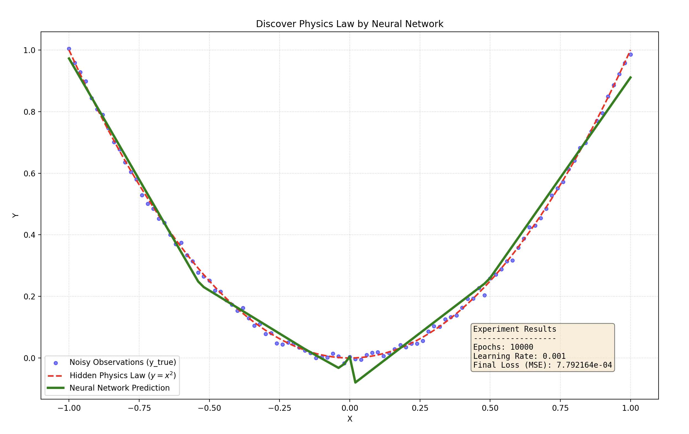

# 从零开始构建深度神经网络，并发现物理规律
# Deep Neural Network From Scratch: Discovering Physics Laws

这个项目通过 Python 和 NumPy 从零开始手写实现了一个深度神经网络（Deep Neural Network, DNN）。项目不仅涵盖了前向传播、反向传播及梯度下降的底层数学推导与代码封装，还展示了如何利用该网络在含有噪声的观测数据中，自主“发现”并拟合隐藏的物理规律（如 $y = x^2$）。

## 📖 推荐阅读：手把手学习笔记

如果你也想了解底层的数学原理，学习如何从零推导矩阵微积分，并一步步用 Python 构建出完整的神经网络框架，**强烈推荐阅读 `notebooks/` 文件夹下的推导笔记！**

里面详细记录了从建立单层神经元、引入 ReLU 激活函数、计算 MSE 损失，到最终通过反向传播实现时间反演（误差回传）的全过程。笔记提供以下两种格式供你选择：

* 交互式运行：`deep_neural_network_from_scratch.ipynb`
* 静态便携阅读：`deep_neural_network_from_scratch.pdf`

## 📂 项目结构

基于模块化的设计，项目从 Jupyter Notebook 的探索性代码重构为清晰的工程目录：

* **`notebooks/`**: 包含早期的核心推导与测试过程（强烈建议阅读这里的笔记）。
* **`src/`**: 核心源码目录。
* `layers.py`: 包含线性层 (`LinearLayer`) 和激活函数 (`ReLU`) 的定义。
* `losses.py`: 包含损失函数 (`MSELoss`) 的定义与梯度反传。
* `network.py`: 神经网络主板 (`NeuralNetwork`)，负责将各个层集成并调度前向与反向过程。


* **`experiments/`**: 存放具体的实验脚本。
* `exp_01_parabola_fit.py`: 利用构建的网络拟合二次抛物线规律的实验主程序。


* **`data/`**: 存放实验产生或需要的数据。

## 🧠 核心组件与数学原理

项目实现了神经网络最关键的几个底层零件，所有的梯度更新均通过严格的矩阵微积分推导得出：

* **LinearLayer (全连接层)**:
* **前向传播**: 利用行向量与广播机制计算 $Z=XW+\vec{1}\vec{b}$。
* **反向传播**: 将梯度回传给上一层 $\frac{\partial L}{\partial X}=\frac{\partial L}{\partial Z}W^{T}$，同时计算当前层权重与偏置的修正力：$\frac{\partial L}{\partial W}=X^{T}\frac{\partial L}{\partial Z}$，$\frac{\partial L}{\partial\vec{b}}=\vec{1}^{T}\frac{\partial L}{\partial Z}$。


* **ReLU (激活函数)**:
* 在前向传播中利用 `self.mask` 留下“记忆节点”以保存 $x>0$ 的信息。
* 反向传播时根据分段导数 $[\frac{\partial}{\partial X}ReLU(X)]_{ij}=\begin{cases}1&if~X_{ij}>0\\ 0&if~X_{ij}\le0\end{cases}$ 精准放行或阻断梯度。


* **MSELoss (均方误差损失)**:
* 评估预测值 $\hat{y}$ 与真实观测值 $y$ 之间的能量/误差：$L=\frac{1}{N}\sum_{i=1}^{N}(\hat{y_{i}}-y_{i})^{2}$。
* 产生反向传播的初始“拉回力”（梯度起爆）：$\frac{\partial L}{\partial\hat{Y}}=\frac{2}{N}(\hat{Y}-Y)$。


* **NeuralNetwork (网络主板)**:
* 利用面向对象的多态性，通过遍历组件列表 `self.layers` 实现系统的前向演化、时间反演（误差回传）以及系统参数坍缩（更新）。


## 🚀 实验：利用神经网络发现物理规律

在 `exp_01_parabola_fit` 实验中，我们生成了 100 个带有随机噪声的粒子状态观测数据（`y_true`），其背后的完美物理规律为 $y = x^2$。

我们实例化的神经网络架构如下：

```python
layers = [
    LinearLayer(1, 50), 
    ReLU(), 
    LinearLayer(50, 10), 
    LinearLayer(10, 1)
]

```

*注：输入特征维度为 1，经过 50 和 10 两个隐藏层，最终输出标量预测。*

**超参数设置：**

* **Learning Rate (步长)**: 0.001
* **Epochs (迭代次数)**: 10000 次

**拟合结果：**
经过 10000 次迭代，网络成功收敛（最终 Loss 约为 0.0002）。从下图中可以看出，神经网络的预测曲线（绿色实线）完美平滑了噪声，并高度贴合了隐藏的真实物理规律（红色虚线）。



## 🛠️ 如何运行

1. 克隆本仓库到本地。
2. 配置 Python 环境并安装依赖：
```bash
pip install -r requirements.txt

```


3. 运行物理规律发现实验：
```bash
python experiments/exp_01_parabola_fit.py

```